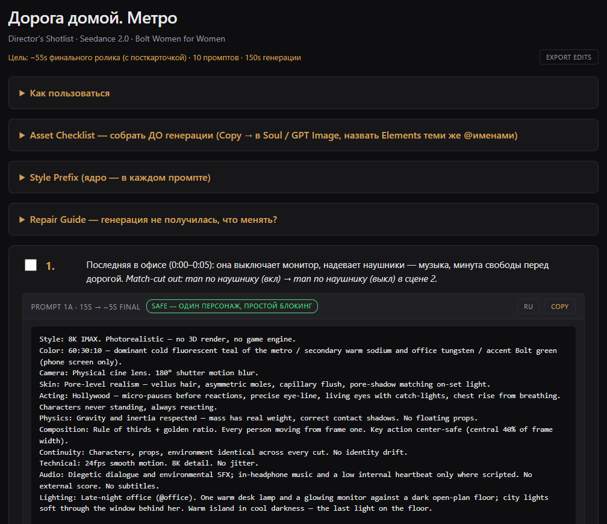

# seedance-shotlist-director

A Claude skill that turns a script (text, synopsis, a single scene) into a director's shotlist for Seedance 2.0 — one self-contained HTML file with copy-ready prompts and production tracking.



*The board UI renders in the user's language — the screenshot above comes from a Russian-language project, which is also why its prompts carry RU translation mirrors. For English users the board is English-only, no mirrors.*

## How it works

1. Input: a script of any length and, optionally, a custom style prefix.
2. The skill breaks it into scenes and 15-second prompts, each in a strict structure: Style CORE + Lighting → Characters → Scene → CUT 1..N → ENDS ON → SFX.
3. Output: `shotlist.html` — opens in the browser; the Copy button hands over the complete standalone prompt for pasting into Seedance.
4. The file is checked with `scripts/validate.mjs` — blocking criteria are verified automatically before the board is presented.

## Skill structure

```
SKILL.md                      core: the directing method, prompt structure, workflow (~220 lines)
references/
  board-spec.md               HTML board mechanics: blocks, localStorage contract, Project Bible schema
  html-template.html          ready-made skeleton (CSS/JS copied verbatim, placeholders filled)
  asset-prompts.md            asset generation prompt patterns (split-frame sheets, AI Cast cards, locations, UI)
  cinematography.md           FOV-in-degrees optics, cut vocabulary and timing, measurable language, i2v first-frame lock
  worked-examples.md          a reference prompt + a reference revision
  extras.md                   9:16 / 1:1 variants and BPM-synced editing (loaded on demand only)
scripts/
  validate.mjs                zero-dep validator for the generated shotlist.html
tests/
  golden-scenarios.md         three stress scenarios + criteria checklist
examples/                     one script built by the original and the current skill
```

The core loads into context on every invocation; reference files load only at the step that needs them (cinematography + worked-examples before writing prompts, board-spec + template before assembling the HTML, extras on trigger). The board's CSS/JS are never re-generated — they are copied from the template, which shrinks the error surface.

## Prompt format

- **Style prefix** is split into an immutable core (optics, skin, physics, continuity, 24fps) and a Lighting line designed separately for every scene (time of day, sources, bridges between scenes).
- **Camera optics in FOV degrees** from an approved table (63° observational wide, 47° neutral, 18° close portrait…) — Seedance holds degrees more reliably than lens millimeters; extreme optics get a LENS LOCK / LENS CHECK protocol.
- **Measurable language** — speed in km/h, fog in % + meters, white balance in Kelvin, scale in stacked human heights; constraints phrased as positive locks.
- **@assets** — characters, locations, and props are referenced by names (`@hero`, `@hero_wet`, `@bottle`) matching Elements in Higgsfield; state variants (wet/dry/bloodied) are separate assets.
- **ENDS ON** — every prompt ends with an exact final-frame description; the next prompt opens from it. Match-cuts are designed between scenes.
- **Dialogue** — lines are written inside CUTs with delivery direction; audio is diegetic only.
- Prompts are always English (a Seedance requirement); scene descriptions and UI follow the user's language.

## The production board (HTML)

- **Asset Checklist** — the first block: what to build in Higgsfield before generating, and HOW — every asset ships its own copy-ready generation prompt (character split-frame sheet, no-branding product sheet, ¾ location, silhouette-only UI screens, layout map as a diagram); patterns follow the Higgsfield Cinema Studio method (`references/asset-prompts.md`).
- **Risk badges** — every prompt is marked safe / tricky / high-risk with a reason (crowd, choreography, on-screen text) and an attempt estimate; the advice is to generate high-risk prompts first.
- **Budget** — a summary up top: target runtime, prompt count, generation seconds, keeper-seconds estimate per prompt (`15s gen → ~3s final`).
- **Tracking** — per prompt: status (not started / generating / retry / keeper), keeper timecode, notes. Stored in localStorage namespaced by the project slug — two boards never collide, and state survives file regeneration.
- **Repair Guide** — a symptom → fix table for typical generation failures (face drift, floating props, choreography mush, clips that won't cut together).
- **Project Bible** — a JSON block inside the HTML with a fixed schema: characters, assets, per-scene lighting, handoffs, statuses. A fresh Claude session restores full project context from the file alone; revisions need no retelling.
- The file has zero external dependencies and works offline; clipboard with a fallback; HTML-escaped prompts.

## Validator

```
node scripts/validate.mjs shotlist.html
```

Zero-dependency (Node ≥18). Checks ~50 points: Project Bible parsing and required keys, Bible ↔ DOM consistency (scenes, prompt ids), localStorage namespacing, completeness of every prompt (CORE, Lighting, Characters, Scene, CUT 1, ENDS ON, SFX), English-only prompts, @references, escaping, status/keeper/notes controls, risk badges, translation mirrors, FOV-degrees (warns on lens-mm), no emoji, no external resources. Exit 1 on any FAIL; duplicated Lighting lines across scenes are a warning. The skill must run the validator after every generation and revision.

## Extras

- **Aspect ratios**: all prompts are composed center-safe (key action inside the central ~40% of frame width); on request the board is re-blocked for 9:16 / 1:1 — tighter shot sizes, depth staging, `1a-v` / `1a-sq` variants.
- **Music sync**: given a BPM, cuts land on bars (240/BPM s) and actions are written on numbered beats; the grid is stored in the Project Bible.
- **Revisions**: edits are applied to the same file — scene numbering and slug stay stable, only the touched parts regenerate; handoffs are re-stitched.
- **Boundaries**: the skill is tuned for Seedance 2.0; for other models (Veo, Kling, Runway, …) the directing method stays but the prompt container adapts instead of being silently applied.

## Examples

[examples/](examples/) — the same script built by two versions of the skill:

- [shotlist_original.html](examples/shotlist_original.html) — the original Higgsfield skill (validator: 17 FAIL)
- [shotlist_improved.html](examples/shotlist_improved.html) — the improved version (validator: 0 FAIL; a warning about missing asset prompts — the example predates them)

Both examples come from a Russian-language project — they double as a demo of the translation-mirror machinery. Both run in CI on every push: the improved one must pass, the original one must fail (proof the validator hasn't lost its teeth).

## Tests

[tests/golden-scenarios.md](tests/golden-scenarios.md) — three stress scenarios (minimal input; 8 scenes with a character state machine; a dialogue drama with rhythm shifts), 10 blocking criteria, 10 scored ones, a revision probe, and an i18n variant (non-English input must still produce English prompts + translation mirrors). The mechanical half of the criteria is automated in `scripts/validate.mjs` (marked `[auto]`); dramatic quality and continuity semantics are checked manually. Every SKILL.md change is regression-tested against them.

## Install

**Claude Code** — put the whole skill folder (SKILL.md + references/ + scripts/) into your skills directory:

```
~/.claude/skills/seedance-shotlist-director/
```

**Claude.ai / Desktop** — download the packaged [`seedance-shotlist-director.skill`](../../releases/latest) from Releases and upload it: Settings → Capabilities → Skills → Upload skill.

Invoke: "make a shotlist" + your script.

## Origin

The first commit of the [original repository](https://github.com/afloy011-spec/seedance-shotlist-director) is the original skill from the [Higgsfield AI tutorial](https://www.youtube.com/watch?v=3rDs6FhFoUQ), verbatim. Everything after is an extension built on top of it. This repository is the English-language edition: board UI defaults, docs, tests, and reference samples localized for English-speaking users; the Russian-first edition lives in the original repo.
